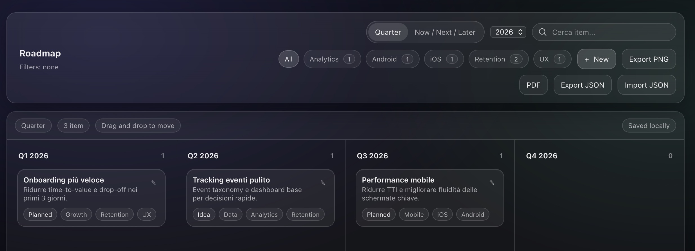

# Product Roadmap MVP

🌍 Live demo  
https://product-roadmap-mvp.netlify.app

A lightweight, offline-first web app to quickly create and share product roadmaps.

Designed for Product Managers, Product Owners, and stakeholders who need a clear, visual roadmap without complex setup or heavy tools.

## ✨ Features
- Quarter view and Now / Next / Later view
- Drag & drop cards between columns
- Tag-based filtering with AND / OR logic
- Tag counters and quick clear filters
- Inline editing via modal
- Export to PDF, PNG, JSON
- Import JSON (exported from the app)
- Offline-first, data stored locally in the browser

## 🧠 Use cases
- Product and feature roadmaps
- Stakeholder presentations
- Portfolio planning
- Strategy discussions and workshops

## 🛠 Tech stack
- Vanilla HTML, CSS, JavaScript
- No backend, no framework
- LocalStorage for persistence

## 🚀 Getting started
- Clone the repository or download the files
- Open `index.html` in your browser  
  or deploy instantly via Netlify

## 📄 License
MIT
